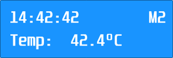
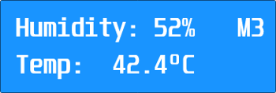
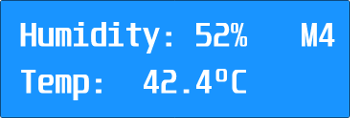

# Beschreibung

Station zur Messung der Außentemperatur und Luftfeuchtigkeit mit vier unterschiedlichen Anzeige-Modi.

# Modi
## M1: Uhrzeit

## M2: Uhrzeit + Außentemperatur

## M3: Luftfeuchtigkeit + Außentemperatur

## M4: Abwechselnd zwischen M1 und M3
     

# Verwendete Hardware
- Nucleo-64
- 16x2 LCD Dot-Matrix Display
- Temperatursensor DS1820
- 4xTaster (zur Steurung der Station)
